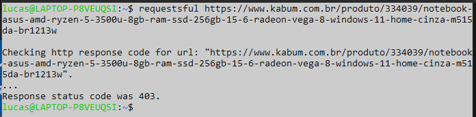
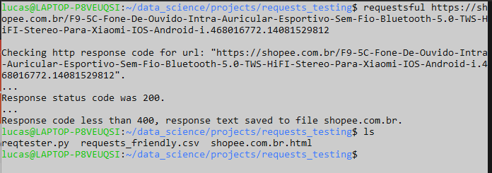
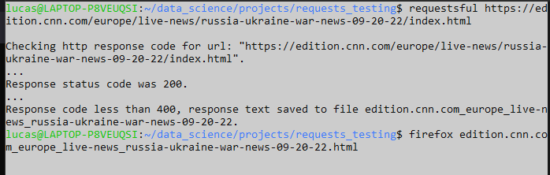

<!DOCTYPE html>
<body>
<html>
<h1 style:'text-align: center; border: 3px solid green'>Test How Webpages Respond to Python's Requests Lib</h1>
 
<h4>This small Python script tests if a given URL is acceptive/receptive or not for Python's Requests lib get method.</h4>
 

Although this kind of checking requires only short, simple code, when having it to be done multiple times, making use of this script can come in handy.

It outputs the <em>response.status_code</em> and, if status is considered successful (less than 400), it will also write down a file with the text of the response (or with the response contents if there is no proper text response).

Besides using a fake user-agent header as Firefox under Windows, it doesn't try any other "trick" to get a successful request response.

<strong>Usage</strong>

This script is intended to be used from terminal with one additional parameter to Python's interpreter as the URL page link.

So, if the following command <em>python3 reqtester.py https://www.google.com</em> is issued into a Linux terminal (from the directory where the script is located), it will start the script with the Google's URL as input argument and tries to figure somehow if google.com is up or not to answer a get request from Requests Python lib.

     

<strong>Works best in Bash terminal with a defined function.</strong>

Write a function like this one at the botton of the .bashrc file:

<em>function requestsful { 
    python3 ~/data_science/projects/requests_testing/reqtester.py $1 
}</em>

Then, just type "<strong>requestsful [URL]</strong>" in terminal to check if a URL is able to be webscrapped with Pythons requests without any further headache.

 

Here are some examples:

 

 

</body>
